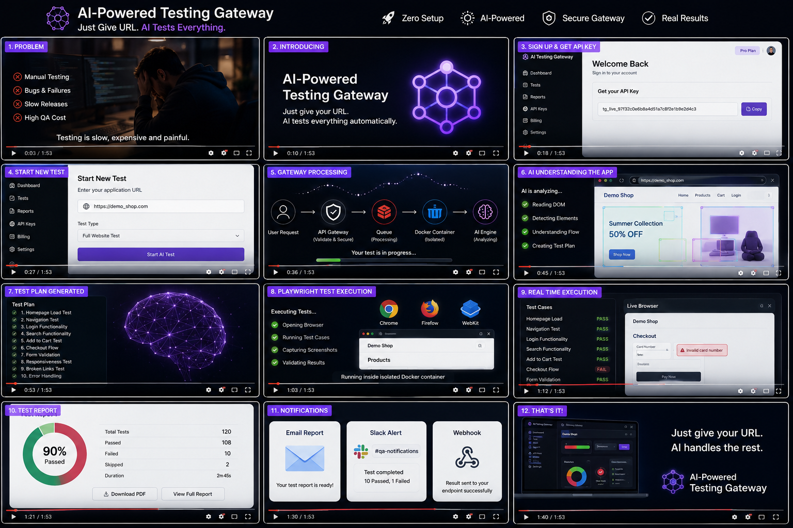

# 🤖 AI-Powered Testing Gateway

<div align="center">

**The world's first Testing-as-a-Service Gateway powered by AI**

*Subscribe → Submit your App URL → AI Tests Everything → Get Full Report*

[]()
[]()
[]()
[]()
[]()
[]()
[]()
[]()
[]()

</div>
<div align="center">

[](https://aitestgateway.netlify.app/)

</div>

---

## 💡 The Problem

Every software company needs to test their application before release. Today they have two options:

- **Manual Testing** — slow, expensive, human error, needs dedicated QA team
- **Existing Automation Tools** — still require technical knowledge, code writing, complex setup, and are expensive

**Nobody has built this:** Just give a URL. AI tests everything. Zero code. Zero setup.

---

## ✅ The Solution

A secure **Testing-as-a-Service Gateway** where:

1. Companies **subscribe** and receive a secure API key
2. They **submit their application URL**
3. The **AI reads the entire application** and plans all test cases
4. **Playwright executes** every test in an isolated browser
5. A **complete report** with screenshots, pass/fail, and recommendations is delivered

> No installation. No code. No QA team needed.

---

## 🏗️ System Architecture

```
╔══════════════════════════════════════════════════════════════════════╗
║                    AI-POWERED TESTING GATEWAY                        ║
║                      SYSTEM ARCHITECTURE                             ║
╚══════════════════════════════════════════════════════════════════════╝

┌─────────────────────────────────────────────────────────────────────┐
│  LAYER 1 — USER                                                     │
│                                                                     │
│                    ┌──────────────────┐                             │
│                    │   Company / User  │                             │
│                    │   (Customer)      │                             │
│                    └────────┬─────────┘                             │
└─────────────────────────────┼───────────────────────────────────────┘
                              │
                              ▼
┌─────────────────────────────────────────────────────────────────────┐
│  LAYER 2 — FRONTEND (PRESENTATION LAYER)                            │
│                                                                     │
│              ┌──────────────────────────────────┐                  │
│              │        Web Dashboard              │                  │
│              │       React / Next.js             │                  │
│              │                                   │                  │
│              │  ● Login / Register               │                  │
│              │  ● API Key Management             │                  │
│              │  ● Submit Application URL         │                  │
│              │  ● View Reports & History         │                  │
│              │  ● Billing / Subscription         │                  │
│              └──────────────┬───────────────────┘                  │
└─────────────────────────────┼───────────────────────────────────────┘
                              │
                              ▼
┌─────────────────────────────────────────────────────────────────────┐
│  LAYER 3 — API GATEWAY (BUSINESS LAYER)                             │
│                                                                     │
│         ┌────────────────────────────────────────────┐             │
│         │            API Gateway                      │             │
│         │         Node.js / Express                   │             │
│         │                                             │──────────▶ PostgreSQL │
│         │  ● API Key Validation                       │             │
│         │  ● Authentication (JWT)                     │──────────▶ Redis     │
│         │  ● Subscription Check                       │            (Queue)    │
│         │  ● Rate Limiting                            │             │
│         │  ● Request Validation                       │             │
│         │  ● Add Job to Queue                         │             │
│         └──────────────────┬──────────────────────────┘             │
└─────────────────────────────┼───────────────────────────────────────┘
                              │
                              ▼
┌─────────────────────────────────────────────────────────────────────┐
│  LAYER 4 — JOB ORCHESTRATOR (SERVICE LAYER)                         │
│                                                                     │
│              ┌──────────────────────────────────┐                  │
│              │        Job Orchestrator           │                  │
│              │                                   │                  │
│              │  ● Pick Job from Queue            │                  │
│              │  ● Create Isolated Environment    │                  │
│              │  ● Manage Execution Flow          │                  │
│              │  ● Update Job Status              │                  │
│              └──────────────┬───────────────────┘                  │
└─────────────────────────────┼───────────────────────────────────────┘
                              │
                              ▼
┌─────────────────────────────────────────────────────────────────────┐
│  LAYER 5 — EXECUTION ENVIRONMENT                                    │
│                                                                     │
│              ┌──────────────────────────────────┐                  │
│              │      Docker Container             │                  │
│              │      (Per Test Run)               │                  │
│              │                                   │                  │
│              │  ● Isolated & Secure              │                  │
│              │  ● Playwright Installed           │                  │
│              │  ● Chromium / Firefox / WebKit    │                  │
│              └──────────────┬───────────────────┘                  │
└─────────────────────────────┼───────────────────────────────────────┘
                              │
                              ▼
┌─────────────────────────────────────────────────────────────────────┐
│  LAYER 6 — AI + TESTING ENGINE                                      │
│                                                                     │
│    ┌──────────────────────────┐    ┌────────────────────────────┐  │
│    │       AI Engine          │    │   Test Execution Engine    │  │
│    │      Claude AI API       │───▶│       (Playwright)         │  │
│    │                          │    │                            │  │
│    │  ● Extract DOM           │    │  ● Convert Test Plan       │  │
│    │    (page.content())      │    │    → Playwright Scripts    │  │
│    │  ● Send HTML to Claude   │    │  ● Execute Test Cases      │  │
│    │  ● AI Understands App    │    │  ● Take Screenshots/Videos │  │
│    │  ● Generate Test Plan    │    │  ● Capture Results & Logs  │  │
│    │    (JSON)                │    │                            │  │
│    └──────────────────────────┘    └────────────────┬───────────┘  │
└─────────────────────────────────────────────────────┼───────────────┘
                                                       │
                                                       ▼
┌─────────────────────────────────────────────────────────────────────┐
│  LAYER 7 — REPORTS & STORAGE                                        │
│                                                                     │
│   ┌───────────────┐  ┌──────────────────┐  ┌──────────────────┐   │
│   │  Test Results │  │  Screenshots &   │  │  HTML / PDF      │   │
│   │    (JSON)     │  │    Videos        │  │  Reports         │   │
│   └───────────────┘  └──────────────────┘  └──────────────────┘   │
│                                                                     │
│                    ┌──────────────────────┐                        │
│                    │    Cloud Storage      │                        │
│                    │   AWS S3 / GCS        │                        │
│                    └──────────────────────┘                        │
└─────────────────────────────────────────────────────────────────────┘
                              │
                              ▼
┌─────────────────────────────────────────────────────────────────────┐
│  LAYER 8 — NOTIFICATION LAYER                                       │
│                                                                     │
│   ┌───────────────┐    ┌──────────────────┐    ┌───────────────┐  │
│   │     Email     │    │    Webhooks       │    │ Slack / Teams │  │
│   │ Notifications │    │                   │    │    Alerts     │  │
│   └───────────────┘    └──────────────────┘    └───────────────┘  │
└─────────────────────────────────────────────────────────────────────┘
```

---

## 🔄 End-to-End Flow — Step by Step

```
  STEP 1          STEP 2          STEP 3          STEP 4          STEP 5
┌─────────┐    ┌─────────┐    ┌─────────┐    ┌─────────┐    ┌─────────┐
│  User   │───▶│Platform │───▶│  User   │───▶│ Gateway │───▶│Orchestr-│
│ Signs Up│    │Generate │    │ Submits │    │Validates│    │  ator   │
│& Selects│    │ API Key │    │App URL  │    │API Key  │    │Creates  │
│  Plan   │    │         │    │         │    │& Queues │    │ Docker  │
└─────────┘    └─────────┘    └─────────┘    └─────────┘    └────┬────┘
                                                                   │
  STEP 9          STEP 8          STEP 7          STEP 6           │
┌─────────┐    ┌─────────┐    ┌─────────┐    ┌─────────┐         │
│  User   │◀───│ Reports │◀───│Playwright│◀───│   AI    │◀────────┘
│Receives │    │Generated│    │Executes │    │ Engine  │
│Notificat│    │& Stored │    │ Tests & │    │Analyzes │
│-ion &   │    │         │    │Collects │    │DOM &    │
│Dashboard│    │         │    │ Results │    │Generate │
│         │    │         │    │         │    │Test Plan│
└─────────┘    └─────────┘    └─────────┘    └─────────┘
```

---

## 🧩 Tech Stack

### Frontend
| Technology | Purpose |
|-----------|---------|
| React.js | User dashboard and UI |
| Next.js | Server-side rendering and routing |
| Tailwind CSS | Styling |

### Backend / Gateway
| Technology | Purpose |
|-----------|---------|
| Node.js + Express | API Gateway server |
| JWT | Authentication and API key validation |
| Redis | Job queue management |
| Rate Limiter | Prevent abuse and overload |

### AI + Testing Engine
| Technology | Purpose |
|-----------|---------|
| Claude AI API | DOM analysis and test plan generation |
| Playwright | Browser automation and test execution |
| Docker | Isolated container per test run |

### Storage & Infrastructure
| Technology | Purpose |
|-----------|---------|
| PostgreSQL | Users, API keys, test results |
| AWS S3 / GCS | Screenshots, videos, PDF reports |
| AWS / GCP | Cloud hosting and deployment |

### Notifications
| Technology | Purpose |
|-----------|---------|
| Email (SMTP) | Test completion notifications |
| Webhooks | Real-time result delivery |
| Slack / Teams | Team alerts |

---

## 🔍 Market Gap Analysis

| Feature | BrowserStack | Testim | Autonoma AI | **Our Gateway** |
|---------|-------------|--------|-------------|----------------|
| Zero Installation | ❌ | ❌ | ❌ | ✅ |
| Just Give a URL | ❌ | ❌ | ❌ | ✅ |
| API Key Gateway | ❌ | ❌ | ❌ | ✅ |
| Full AI Auto-Test | ⚠️ Partial | ⚠️ Partial | ⚠️ Partial | ✅ |
| Zero Human Input | ❌ | ❌ | ❌ | ✅ |
| Affordable for SMEs | ❌ | ❌ | ❌ | ✅ |

> No competitor has this exact combination. This is a genuine first-mover opportunity.

---

## 💼 Business Model

| Plan | Price | Tests / Month | Reports | Support |
|------|-------|--------------|---------|---------|
| Free | $0 | 50 | Basic | Community |
| Starter | $29/mo | 500 | PDF | Email |
| Pro | $99/mo | 5,000 | Full Dashboard | Priority |
| Enterprise | Custom | Unlimited | Custom | Dedicated |

---

## 📁 Project Structure (Planned)

```
ai-testing-gateway/
│
├── frontend/                  → React / Next.js Dashboard
│   ├── components/
│   ├── pages/
│   └── styles/
│
├── gateway/                   → Node.js API Gateway
│   ├── routes/
│   ├── middleware/
│   │   ├── auth.js            → JWT + API Key validation
│   │   └── rateLimiter.js     → Rate limiting
│   ├── queue/
│   │   └── jobQueue.js        → Redis queue manager
│   └── server.js
│
├── orchestrator/              → Job Orchestrator Service
│   ├── jobProcessor.js
│   └── dockerManager.js       → Docker container lifecycle
│
├── ai-engine/                 → AI Test Planner
│   ├── domExtractor.js        → Playwright DOM extraction
│   ├── claudeClient.js        → Claude AI API integration
│   └── testPlanner.js         → Generate test plan JSON
│
├── test-runner/               → Playwright Test Executor
│   ├── testRunner.js          → Execute test plan
│   ├── actionExecutor.js      → Convert AI steps → Playwright
│   └── reportBuilder.js       → Build JSON / PDF report
│
├── reports/                   → Report Generator
│   ├── pdfGenerator.js
│   └── storageUploader.js     → AWS S3 upload
│
├── notifications/             → Notification Service
│   ├── emailService.js
│   ├── webhookService.js
│   └── slackService.js
│
├── docker/
│   └── Dockerfile.testrunner  → Docker image for test runs
│
└── docker-compose.yml         → Full local dev setup
```

---

## 🗺️ Development Roadmap

```
Month 1-2   ████████░░░░░░░░░░░░  Research & Architecture ✅
Month 3     ░░░░░░░░░░░░░░░░░░░░  System Design & DB Schema
Month 4     ░░░░░░░░░░░░░░░░░░░░  API Gateway + Auth MVP
Month 5     ░░░░░░░░░░░░░░░░░░░░  Playwright Core Engine
Month 6     ░░░░░░░░░░░░░░░░░░░░  Claude AI Integration
Month 7     ░░░░░░░░░░░░░░░░░░░░  Report Generator
Month 8     ░░░░░░░░░░░░░░░░░░░░  Docker + Security
Month 9     ░░░░░░░░░░░░░░░░░░░░  React Dashboard
Month 10    ░░░░░░░░░░░░░░░░░░░░  Beta Testing (10 companies)
Month 11    ░░░░░░░░░░░░░░░░░░░░  Bug Fixes & Optimization
Month 12    ░░░░░░░░░░░░░░░░░░░░  Public Launch 🚀
```

---

## 👨‍💻 Author

**Manikanta Chalasani**
Frontend Engineer | FinTech & Trading Systems | System Design

[](mailto:manikantachalasani08@gmail.com)
[](https://linkedin.com/in/YOUR_LINKEDIN)
[](https://github.com/Manikantach03)

---

<div align="center">

⭐ **If this idea excites you, give this repo a star!**

*This product does not exist in the market yet.*
*Building it one layer at a time.*

</div>
